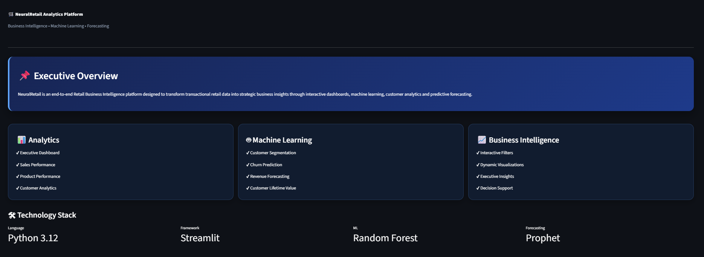
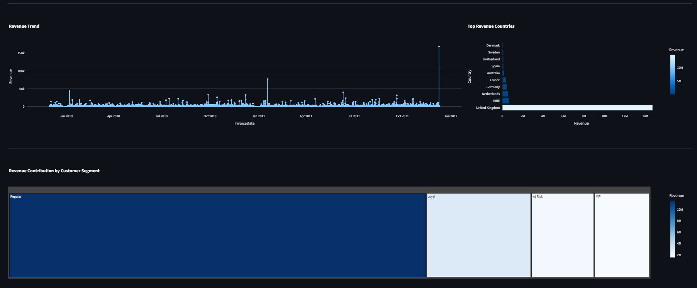
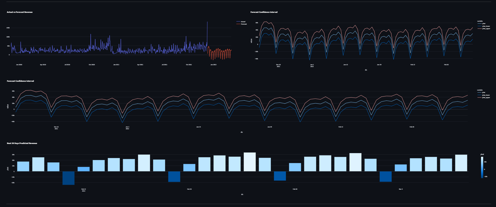
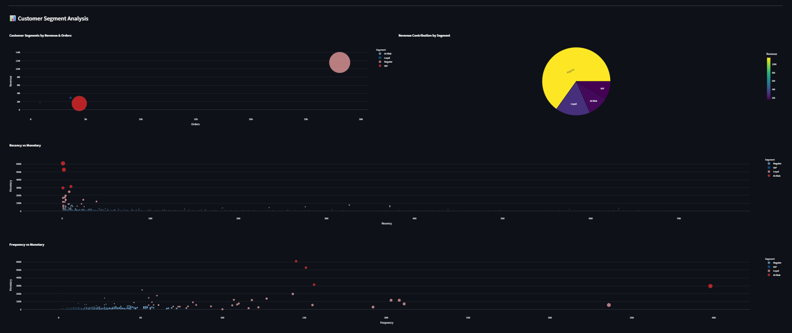
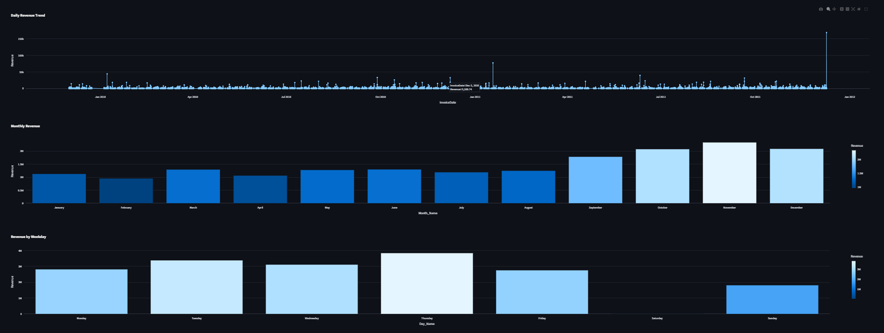
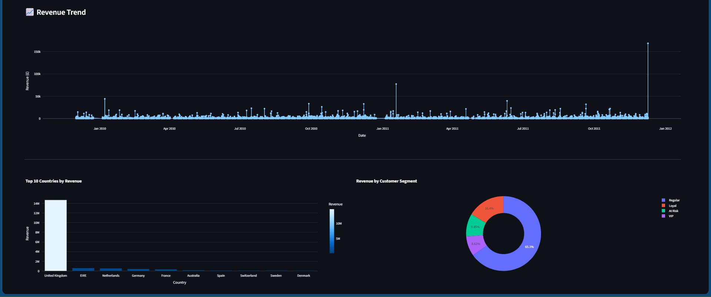

# 🛒 NeuralRetail Analytics Platform

An end-to-end **Retail Analytics Platform** built using **Python, Streamlit, Machine Learning, and Business Intelligence**. The platform transforms retail transaction data into actionable business insights through interactive dashboards, predictive analytics, and customer intelligence.

---

# 📸 Project Preview

## 🏠 Home Page



---

## 📋 Executive Business Summary



---

## 🔮 Revenue Forecast Dashboard



---

## 🎯 Customer Segmentation Dashboard



---

## 📈 Sales Performance Dashboard



---

## 📊 Executive Dashboard

.

---

# 🎯 Project Objectives

* Analyze retail sales performance
* Monitor product and inventory performance
* Understand customer purchasing behavior
* Segment customers using RFM Analysis and K-Means Clustering
* Predict customer churn using Machine Learning
* Forecast future revenue
* Deliver executive-level business insights through interactive dashboards

---

# 🚀 Features

### 📊 Interactive Dashboards

* Executive Dashboard
* Sales Performance Dashboard
* Product Performance Dashboard
* Customer Analytics Dashboard
* Country Performance Dashboard
* Monthly & Seasonal Sales Dashboard
* Customer Segmentation Dashboard
* Customer Churn Dashboard
* Inventory Analysis Dashboard
* Order Analysis Dashboard
* Customer Lifetime Value Dashboard
* Executive Business Summary

### 🤖 Machine Learning

* Customer Segmentation using **RFM Analysis + K-Means**
* Customer Churn Prediction using **Random Forest**
* Revenue Forecasting using **Prophet**

---

# 🛠 Technology Stack

| Category             | Technology             |
| -------------------- | ---------------------- |
| Programming Language | Python 3.12            |
| Framework            | Streamlit              |
| Data Analysis        | Pandas, NumPy          |
| Visualization        | Plotly Express         |
| Machine Learning     | Scikit-learn           |
| Forecasting          | Prophet                |
| ML Algorithms        | Random Forest, K-Means |
| Development          | Jupyter Notebook       |

---

# 📂 Project Structure

```text
NeuralRetail/
│
├── Main.py
│
├── pages/
│   ├── 1_Executive_Dashboard.py
│   ├── 2_Sales_Trend.py
│   ├── 3_Product_Performance.py
│   ├── 4_Customer_Analytics.py
│   ├── 5_Country_Analysis.py
│   ├── 6_Revenue_Forecasting.py
│   ├── 7_Customer_Segmentation.py
│   ├── 8_Customer_Churn.py
│   ├── 9_Inventory_Analysis.py
│   ├── 10_Order_Analysis.py
│   ├── 11_Customer_Lifetime_Value.py
│   └── 12_Executive_Summary.py
│
├── data/
│   ├── raw/
│   └── processed/
│
├── notebooks/
├── screenshots/
├── requirements.txt
└── README.md
```

---

# 📊 Dashboard Modules

* 📊 Executive Dashboard
* 📈 Sales Performance Dashboard
* 📦 Product Performance Dashboard
* 👥 Customer Analytics Dashboard
* 🌍 Country Performance Dashboard
* 📅 Monthly & Seasonal Sales Dashboard
* 🎯 Customer Segmentation Dashboard
* 🔄 Customer Churn Dashboard
* 📦 Inventory Analysis Dashboard
* 🛒 Order Analysis Dashboard
* 💎 Customer Lifetime Value Dashboard
* 📋 Executive Business Summary

---

# 💼 Business Value

NeuralRetail enables businesses to:

* Identify high-performing products and customers
* Monitor sales and revenue trends
* Detect customers at risk of churn
* Improve inventory planning
* Forecast future revenue
* Support data-driven business decisions

---

# 🔮 Future Enhancements

* Cloud deployment
* Real-time database integration
* Automated reporting
* Recommendation system

---

# 👩‍💻 Developed By

**Shraddha Shri**

Engineering Student

**Python | Streamlit | Machine Learning | Business Intelligence**

---

# 📄 License

This project was developed for educational and internship purposes.
